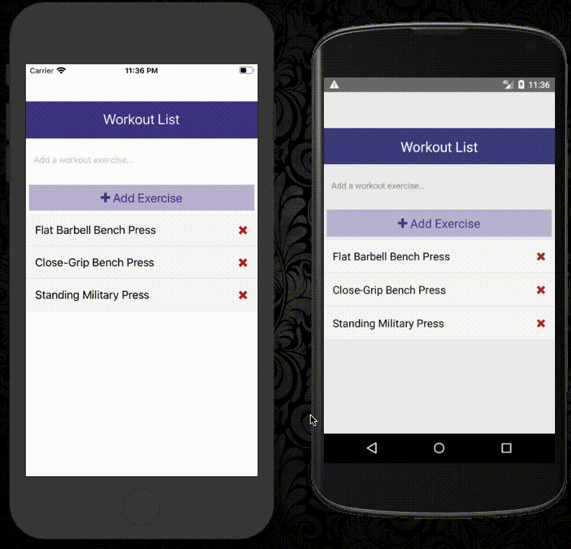

# React Native Workout list App

* Develop a workout list app that works on both Android and iOS.
* You can add and remove the workout exercise that you want.
* Explore the usage of React Native framework, and cross platform.

## How I built it

* I built it with React Native and ReactJS framework

## Check it out (Coming Soon on both App Store and Play Store)

```bash
# Install dependencies
npm install
cd ios && pod install && cd ..

# Run on iOS
react-native run-ios

# Run on Android
react-native run-android
```


